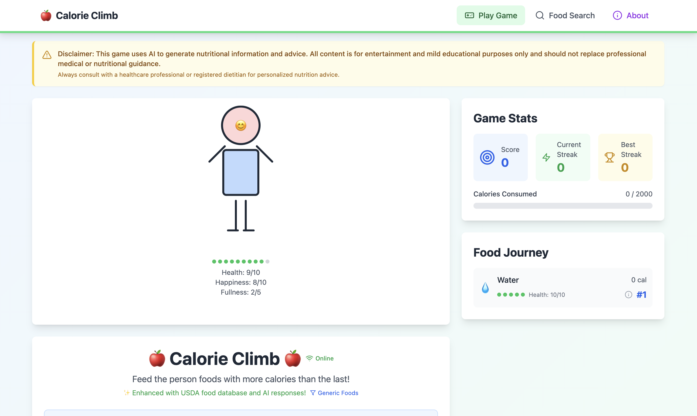

# 🍎 Calorie Climb - Kids Nutrition Learning Game

A fun, educational web game that teaches children about nutrition and healthy eating through interactive calorie climbing gameplay. Built with React, TypeScript, and integrated with the USDA Food Database for accurate nutritional information.



## 🎯 What is Calorie Climb?

Calorie Climb is an educational game where kids feed a virtual character different foods, learning about calories and nutrition in the process. The goal is to "climb" the calorie ladder by choosing foods with progressively more calories while keeping the character healthy and happy.

### Key Features

- 🥗 **Real Food Data**: Uses the official USDA Food Data Central database
- 🤖 **AI-Enhanced Learning**: Educational feedback powered by Perplexity AI
- 🎮 **Gamified Education**: Makes nutrition learning fun and engaging
- 👨‍👩‍👧‍👦 **Family Friendly**: Safe, kid-appropriate content with alcohol filtering
- 📱 **Responsive Design**: Works on desktop, tablet, and mobile devices
- 🔍 **Food Search**: Explore thousands of foods with detailed nutrition information

## 🚀 Live Demo

Visit the live application: [https://calorieclimb.com](https://calorieclimb.com)

## 🛠️ Technology Stack

- **Frontend**: React 18 with TypeScript
- **Styling**: Tailwind CSS
- **Routing**: React Router
- **Icons**: Lucide React
- **APIs**: USDA Food Data Central, Perplexity AI
- **Build Tool**: Vite
- **Deployment**: Netlify

## 🏃‍♂️ Quick Start

### Prerequisites

- Node.js (version 18 or higher)
- npm or yarn package manager

### Installation

1. **Clone the repository**
   ```bash
   git clone https://github.com/daveklee/calorieclimb.com.git
   cd calorieclimb.com
   ```

2. **Install dependencies**
   ```bash
   npm install
   ```

3. **Set up environment variables** (optional but recommended)
   ```bash
   cp .env.example .env
   ```
   
   Add your API keys to `.env`:
   ```env
   VITE_USDA_API_KEY=your_usda_api_key_here
   VITE_PERPLEXITY_API_KEY=your_perplexity_api_key_here
   VITE_GA_MEASUREMENT_ID=your_ga_measurement_id_here
   ```

4. **Start the development server**
   ```bash
   npm run dev
   ```

5. **Open your browser** to `http://localhost:5173`

### API Keys (Optional)

The app works in offline mode without API keys, but for the full experience:

- **USDA API Key**: Get free access at [USDA Food Data Central](https://fdc.nal.usda.gov/api-guide.html)
- **Perplexity API Key**: Sign up at [Perplexity AI](https://www.perplexity.ai/)
- **Google Analytics**: Create a GA4 property for analytics

## 🎮 How to Play

1. **Start with Water**: The game begins with the character drinking water (0 calories)
2. **Choose Foods**: Type in food names to feed the character
3. **Climb the Ladder**: Each new food must have more calories than the previous one
4. **Stay Healthy**: Keep the character healthy and happy with good food choices
5. **Reach the Goal**: Try to reach the calorie limit while maintaining good health

### Game Modes

- **Online Mode**: Access to 300,000+ foods from the USDA database with AI feedback
- **Offline Mode**: Curated list of common foods with basic educational content

## 📁 Project Structure

```
src/
├── components/          # Reusable UI components
│   ├── Character.tsx    # Animated character display
│   ├── GameInterface.tsx # Main game controls
│   ├── GameStats.tsx    # Score and progress tracking
│   ├── FoodHistory.tsx  # Food consumption history
│   └── Navigation.tsx   # App navigation
├── pages/              # Page-level components
│   ├── GamePage.tsx    # Main game page
│   ├── FoodSearchPage.tsx # Food database explorer
│   └── AboutPage.tsx   # About and information page
├── services/           # External API integrations
│   ├── usdaApi.ts      # USDA Food Database API
│   └── perplexityApi.ts # Perplexity AI API
├── utils/              # Utility functions
│   ├── foodService.ts  # Food search and management
│   ├── gameLogic.ts    # Game rules and calculations
│   ├── foodDatabase.ts # Offline food database
│   ├── analytics.ts    # Google Analytics integration
│   └── envConfig.ts    # Environment configuration
└── types/              # TypeScript type definitions
    └── game.ts         # Game-related types
```

## 🔧 Available Scripts

- `npm run dev` - Start development server
- `npm run build` - Build for production
- `npm run preview` - Preview production build
- `npm run lint` - Run ESLint

## 🌟 Features in Detail

### Character System
- Visual representation of health, happiness, and fullness
- Dynamic expressions based on food choices
- Size changes based on calorie consumption

### Food Database Integration
- **Generic Foods**: Common foods like "apple", "chicken breast"
- **Branded Foods**: Specific products with brand names
- **Nutritional Data**: Calories, nutrients, serving sizes
- **Safety Filtering**: Automatic removal of inappropriate content

### Educational Feedback
- AI-generated explanations about food choices
- Health ratings for different foods
- Positive reinforcement for healthy choices
- Learning about portion sizes and nutrition

### Accessibility
- Keyboard navigation support
- Screen reader friendly
- High contrast color schemes
- Mobile-responsive design

## 🤝 Contributing

We welcome contributions from developers, educators, nutritionists, and parents! See [CONTRIBUTING.md](CONTRIBUTING.md) for detailed guidelines.

### Ways to Contribute

- 🐛 Report bugs or suggest features
- 💻 Submit code improvements
- 📚 Improve documentation
- 🎨 Enhance design and user experience
- 🍎 Suggest educational content improvements

## 📄 License

This project is licensed under the Creative Commons Attribution-NonCommercial 4.0 International License (CC BY-NC 4.0). This means you are free to share and adapt the work for non-commercial purposes, but you must give appropriate credit and cannot use it commercially.

For full license details, see [LICENSE](LICENSE) file.

## ⚠️ Important Disclaimers

- **Not Medical Advice**: This app is for educational purposes only and is not medical advice
- **AI-Generated Content**: Food descriptions are generated by AI and should be validated
- **Parental Guidance**: Designed for kids but parental supervision is recommended
- **Content Filtering**: While we filter inappropriate content, please report any issues

## 🙏 Acknowledgments

- **USDA Food Data Central**: For providing comprehensive food nutrition data
- **Perplexity AI**: For educational content generation
- **React Community**: For the amazing ecosystem and tools
- **Contributors**: Everyone who helps make this project better

## 📞 Support

- **Issues**: Report bugs or request features on GitHub
- **Questions**: Use GitHub Discussions for general questions
- **Security**: Report security issues privately via email

---

Made with ❤️ for kids and families who want to learn about nutrition in a fun way!

## 🔗 Links

- [Live Demo](https://calorieclimb.com)
- [USDA Food Data Central](https://fdc.nal.usda.gov/)
- [Perplexity AI](https://www.perplexity.ai/)
- [Contributing Guidelines](CONTRIBUTING.md)

---

*"Teaching kids about nutrition, one calorie at a time!"* 🍎✨